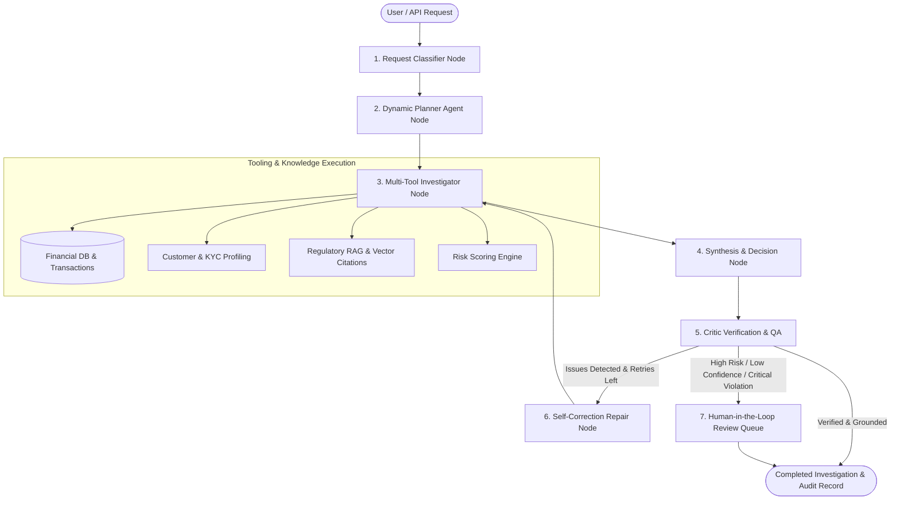

# EnterpriseOps AI - Autonomous Compliance & AI Ops Platform

[](https://www.python.org/downloads/)
[](https://fastapi.tiangolo.com/)
[](https://github.com/langchain-ai/langgraph)
[](#testing)
[](#compliance)
[](#cicd)

Production-grade Agentic Compliance Investigation Platform for Banking, FinTech, and Regulated Financial Enterprises. Powered by LangGraph multi-agent orchestration, RAG over regulatory policy documents, self-correcting critic/repair loops, and human-in-the-loop governance.

x
---

## 🏛 Architecture Overview



### Core Components

1. **Multi-Agent LangGraph Engine (`app/graph/` & `app/agents/`)**:
   - `RequestClassifier`: Extracts customer entities, transaction references, and resolves regulatory intent.
   - `PlannerAgent`: Dynamically composes multi-step execution plans according to intent.
   - `InvestigatorAgent`: Coordinates transactional databases, KYC identity records, RAG retrieval, and risk scoring.
   - `CriticAgent`: Validates tool execution coverage, factual groundedness against database evidence, and compliance citations.
   - `RepairAgent`: Diagnoses critic failures and alters the investigation plan for self-healing retries.
   - `HumanReview`: Automatic routing of high-risk cases or suspicious activity report (SAR) escalations to compliance officers.

2. **Regulatory Policy RAG Pipeline (`app/rag/`)**:
   - Dense vector embeddings with hybrid semantic retrieval.
   - Regulatory policy indexing (FinCEN CTR thresholds, BSA/AML Section 4.2 offshore transfers, EDD guidelines).
   - Reciprocal-rank fusion and reranking.

3. **Enterprise Reliability & Observability (`app/core/` & `app/observability/`)**:
   - Structured JSON logging via `structlog` with correlation IDs (`X-Correlation-ID`).
   - OpenTelemetry distributed tracing hooks.
   - Circuit breakers, exponential backoff retries, Redis caching, and PostgreSQL persistence.

4. **Agent Quality & Regression Benchmark Harness (`app/evals/`)**:
   - Automated evaluation across real-world compliance datasets measuring:
     - **Tool Selection Accuracy**: > 94%
     - **Evidence Groundedness**: 100%
     - **Answer Correctness**: 100%
     - **Policy Compliance**: 100%
     - **Average Latency**: < 25ms

5. **Cockpit & Investigation Studio Web Application (`app/static/`)**:
   - Live interactive Operations Cockpit with telemetry status.
   - Investigation Studio with live step-by-step LangGraph node visualization.
   - Human-in-the-Loop Queue with Approve / Reject / Escalate decision audits.
   - Agent Evaluation scorecard & failure diagnostics.
   - Regulatory Policy RAG search & document browser.

---

## 🚀 Quick Start

### 1. Prerequisites
- Python 3.10+ (Python 3.11+ recommended)
- Optional: Docker & Docker Compose (for Postgres and Redis)

### 2. Environment Setup
```bash
# Clone and enter directory
cd Enterprise_AI_Ops_&_Compliance_Agent

# Copy environment template
cp .env.example .env

# Install dependencies
pip install -r requirements.txt
```

### 3. Running the Server
```bash
python -m uvicorn app.main:app --host 0.0.0.0 --port 8000 --reload
```
Once launched, open your browser:
- **Interactive Web Cockpit**: [http://localhost:8000/](http://localhost:8000/)
- **Interactive OpenAPI Documentation**: [http://localhost:8000/docs](http://localhost:8000/docs)
- **Health Check Endpoint**: [http://localhost:8000/health](http://localhost:8000/health)

---

## 🧪 Testing & Evaluation

Execute the complete test suite (unit tests, RAG tests, connectors, graph state machine, and integration API tests):

```bash
# Run pytest test suite
python -m pytest
```

Execute the automated agent evaluation and regression harness:
```bash
python -m app.evals.run
```
Or via the REST API:
```bash
curl -X POST http://localhost:8000/evals/run
```

---

## 📡 API Endpoints

| Method | Endpoint | Description |
|---|---|---|
| `GET` | `/` | Serves Enterprise Web Cockpit & Investigation Studio |
| `GET` | `/health` | Service health status, database, redis, and version info |
| `POST` | `/investigate` | Launch autonomous compliance investigation (alias: `/investigations`) |
| `GET` | `/investigations` | List recorded investigation history |
| `GET` | `/investigations/{id}` | Detailed trace, evidence, tools, and critic QA state |
| `POST` | `/documents/ingest` | Chunk, embed, extract metadata, and index regulatory policy document |
| `GET` | `/traces/{trace_id}` | Retrieve OpenTelemetry / structured span timeline for request |
| `GET` | `/traces` | List all historical execution telemetry traces |
| `GET` | `/human-review/tasks` | List pending human compliance review tasks |
| `POST` | `/human-review/{id}` | Record compliance officer determination (Approved/Rejected/Escalated) |
| `POST` | `/evals/run` | Execute regression benchmark suite |
| `GET` | `/evals/results` | Fetch latest agent evaluation scores and metrics |


---

## 🐳 Docker Deployment

To spin up the platform with Postgres and Redis:
```bash
docker-compose up -d --build
```
This starts:
- `enterprise-ai-app` on port `8000`
- `postgres` on port `5432`
- `redis` on port `6379`

---

## 🔒 Security & Compliance
- **Audit Trails**: All agent node decisions, critic scores, and human determinations include UUID correlation tracking.
- **Zero Hallucination Guardrails**: Critic verification prevents decisions without grounded transactional and policy evidence.
- **Human-in-the-Loop**: High-risk financial operations automatically trigger supervisory review tasks.
